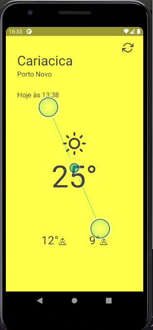

# App go Clima
### Aplicativo desenvolvido para exibir previsão metereologica



Execute os seguintes comando para testar o app

para instalar todas as libs dependetes
```
yarn install
```

Para criar o app e instalar no emulador ou dispositivo fisico
```
yarn android or yarn ios

```


