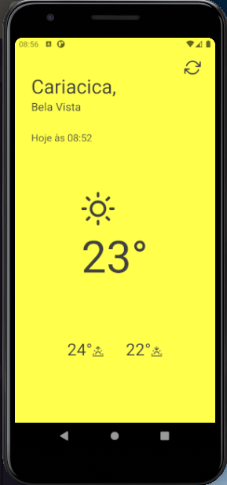

# Go Clima
> Aplicativo desenvolvido para obter a localização atual do usuario via geolocalização e exibir dados climaticos.

[![NPM Version][npm-image]][npm-url]
[![Build Status][travis-image]][travis-url]
[![Downloads Stats][npm-downloads]][npm-url]

O App tem como como objetivo auxiliar o usuario no clima da região onde ele se encontra, 
a ideia proposta seria de obter a localização geografica de onde o usuario estaria localizado e
com esse dados exibir o endereço e as condições climaticas de onde o mesmo se encontra
 e um botão para atualizar a aplicação caso ele mude de região.



## Instalação e configurações

Android:

Realize um git clone em sua maquina

```sh
git clone https://github.com/VinnyLima/appGoClima.git
```

IOS

```sh
git clone https://github.com/VinnyLima/appGoClima.git
```
## Mais configurações

Após clonar o repositorio realize os seguinte comandos

Para instalar as libs
```sh
# YARN
yarn install

#NPM
npm install
```

Para realizar a criação do aplicativo no emulador ou dispositivo fisico(Smarthphone)
```sh
# YARN
yarn android
ou
yarn ios

#NPM
npm android
ou 
npm ios

#Direct
react-native run-android
react-native run-ios
```
Para executar o app no emulador ou dispositivo fisico(Smarthphone);
```sh
# YARN
yarn start

#NPM
npm start

#Direct
react-native start
```


## Usando

O Aplicativo necessita de duas keys do google e da Open Weather Map para obter a localização por endereço e a codições climaticas
como pode ser observado no codigo abaixo;

```sh
const apikeyGeocoding = 'XXXXXXXXXXXXXXXXXXXXXXXXXXXXXXXXX';

async function handleAndress(latitude: number, longitude: number) {
          var response = await apiGeoc.get(`/json?latlng=${latitude},${longitude}&key=${apikeyGeocoding}
            `);
            setAddress({
              cidade: response.data.results[0].address_components[3].long_name,
              bairro: response.data.results[0].address_components[2].long_name,
            })          
        }SeuNome
        handleAndress(userPosition.latitude, userPosition.longitude);

const apikey = 'xxxxxxxxxxxxxxxxxxxxxxxx';

         async function handleWealther(latitude: number, longitude: number) {
          var response = await api.get(
            `2.5/weather?lat=${latitude}&lon=${longitude}&appid=${apikey}`,
          );
          if (response.data) {
            setVerifiObject(true);            
            setWeather({
              temp: response.data.main.temp,
              tempMax: response.data.main.temp_max,
              tempMin: response.data.main.temp_min,
            })
          }
        }
        handleWealther(userPosition.latitude, userPosition.longitude);

```
Ambas estão disponiveis no codigo do app, caso na data que você eteja rodando esse app elas podem não estar mais disponiveis
oriento você criar a suas propias keys, segue os links

[Geocoding](https://developers.google.com/maps/documentation/geocoding/get-api-key?hl=pt)
[Open Weather Map](https://openweathermap.org/api)


## Histórico de lançamentos

* 0.3.1
    * ADD: Adicionando  componente `<ShimmerPlaceHolder>` para carregamento do app enquanto os dados são capturado nas apis.
* 0.2.5
    * MUDANÇA: Removendo interface  `WealtherDatas` interface estava errada e calsando erro no carregamento do app
    * MUDANÇA: Alterando a forma de inserção dos dados nos estados de forma asincrona, tornando as interfaces criadas funcionais.
* 0.2.1
    * ADD: Criação da função `handleWealther()` responsavel por capturar dados climaticos
    * ADD: Criação da função `handleAndress(latitude: number, longitude: number)` responsavel por obter o endereço do usuario 
* 0.1.9    
    * Criação da função `handleLocation()` 
    * Desenvolvimento da mesma para obter a geolocalização
    * Criando template para receber dados vindos das apis
* 0.0.1
    * Coletando libs para desenvolvimento
    * Escolhendo melhor template 

## Meta

Vinicius Lima – [![twitter]](https://twitter.com/pvinfoltec) – paulo.vinicius.f.l@live.com
 

[Git](https://github.com/othonalberto/)


[npm-image]: https://img.shields.io/npm/v/datadog-metrics.svg?style=flat-square
[npm-url]: https://npmjs.org/package/datadog-metrics
[npm-downloads]: https://img.shields.io/npm/dm/datadog-metrics.svg?style=flat-square
[travis-image]: https://img.shields.io/travis/dbader/node-datadog-metrics/master.svg?style=flat-square
[travis-url]: https://travis-ci.org/dbader/node-datadog-metrics
[twitter]:https://img.shields.io/twitter/url?style=social&url=https%3A%2F%2Ftwitter.com%2Fpvinfoltec

